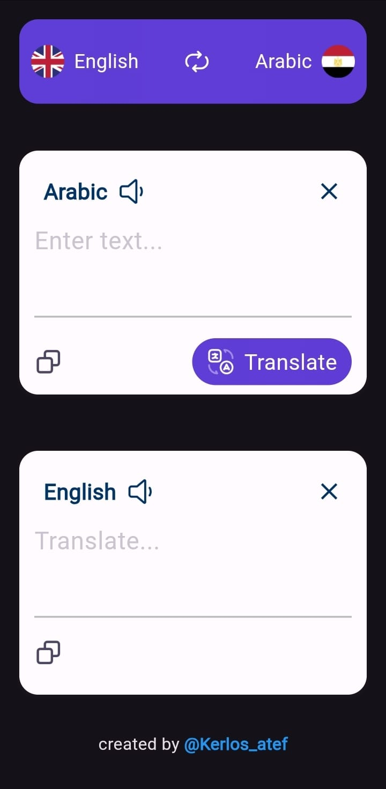

# Translation App

This Flutter app allows users to translate text between Arabic and English. It supports copying and pasting translated text, as well as swapping languages.

## Features

- **Text Translation**: Translate text from Arabic to English and vice versa.
- **Text Copying**: Copy the entered or translated text to the clipboard.
- **Language Swap**: Swap the source and target languages (Arabic and English).
- **Responsive Design**: The app adjusts to different screen sizes for optimal viewing.
- **Text-to-Speech**: Listen to the translated text in the selected language.
## Screenshots



## Installation

### Prerequisites

1. Install Flutter from [flutter.dev](https://flutter.dev).
2. Set up an API key for Google Cloud Translation service.

### Steps

Clone this repository:
```bash
git clone https://github.com/kerlosatef/translation-app.git
```
Navigate to the project directory:
```
cd translation-app
```
Install dependencies:
```
flutter pub get
```
Replace the placeholder API key in lib/main.dart:
```
_translation = Translation(apiKey: 'Your_API_Key');
```
Run the app:
```
flutter run
```

## Usage
- **Text Input**: Enter the text you want to translate in the provided text field.
- **Copy**: Tap the copy icon to copy the text to the clipboard.
- **Translate**: Tap the translate icon to translate the text.
- **Swap Languages**: Tap the swap icon to switch between Arabic and English.
- **Text-to-Speech**: Listen to the translated text in the selected language.


## API
This app uses the Google Cloud Translation API for text translation.

## Contributing
Feel free to fork this repository and submit pull requests to improve the app. If you encounter any issues, please create an issue in the GitHub repository.

## License
This project is licensed under the MIT License - see the LICENSE file for details.

## Author
Created by @Kerlos_atef.


