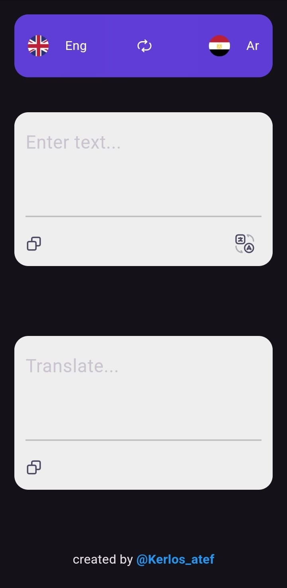

# Translation App

This Flutter app allows users to translate text between Arabic and English. It supports copying and pasting translated text, as well as swapping languages.

## Features

- **Text Translation**: Translate text from Arabic to English and vice versa.
- **Text Copying**: Copy the entered or translated text to the clipboard.
- **Language Swap**: Swap the source and target languages (Arabic and English).
- **Responsive Design**: The app adjusts to different screen sizes for optimal viewing.

## Screenshots



## Installation

### Prerequisites

1. Install Flutter from [flutter.dev](https://flutter.dev).
2. Set up an API key for Google Cloud Translation service.

### Steps

1. Clone this repository:

   ```bash
   git clone https://github.com/kerlosatef/translation-app.git
